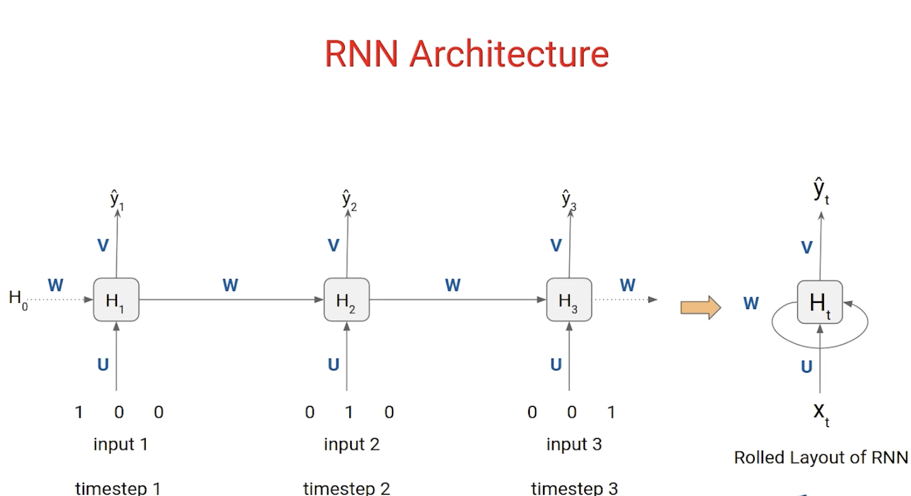

# Understanding Recurrent Neural Networks (RNNs) and Time Series Analysis

## 1. Recurrent Neural Networks (RNNs)

Recurrent Neural Networks (RNNs) are a class of neural networks designed to recognize patterns in sequences of data, such as text, speech, or time series. Unlike traditional feedforward neural networks, RNNs have internal memory, allowing them to process sequences by maintaining a hidden state that captures information about previous elements in the sequence. This "memory" makes them particularly well-suited for tasks where context from past inputs is crucial for understanding current inputs.

### How RNNs Work:

The core idea behind RNNs is the recurrence relation. At each time step `t`, an RNN takes an input `x_t` and its hidden state from the previous time step `h_{t-1}` to produce an output `y_t` and an updated hidden state `h_t`.

The hidden state `h_t` is calculated as:
`h_t = f(W_hh * h_{t-1} + W_xh * x_t + b_h)`

The output `y_t` is calculated as:
`y_t = W_hy * h_t + b_y`

Where:
- `x_t`: Input at time step `t`
- `h_t`: Hidden state at time step `t`
- `y_t`: Output at time step `t`
- `W_hh`, `W_xh`, `W_hy`: Weight matrices for hidden-to-hidden, input-to-hidden, and hidden-to-output connections, respectively. These weights are shared across all time steps.
- `b_h`, `b_y`: Bias vectors.
- `f`: An activation function (e.g., tanh or ReLU).

This recurrent connection allows information to persist from one step to the next, enabling the network to learn dependencies across time.

### Challenges with Traditional RNNs:

While powerful, traditional RNNs suffer from two main issues:

1.  **Vanishing Gradients:** During backpropagation through time (BPTT), the gradients can shrink exponentially as they propagate backward through many layers (time steps). This makes it difficult for the network to learn long-term dependencies, as the influence of earlier inputs on later outputs diminishes rapidly.
2.  **Exploding Gradients:** Conversely, gradients can also grow exponentially, leading to unstable training and large weight updates that prevent convergence. Gradient clipping is often used to mitigate this.

These challenges led to the development of more advanced recurrent architectures like LSTMs and GRUs, which are better equipped to handle long-term dependencies.


## 2. Time Series Analysis in Python

Time series data is a sequence of observations recorded at successive time intervals. Analyzing time series involves understanding patterns, trends, seasonality, and randomness to forecast future values or understand underlying processes.

### Key Components of Time Series:

*   **Trend:** A long-term increase or decrease in the data.
*   **Seasonality:** Regular, predictable patterns that repeat over a fixed period (e.g., daily, weekly, monthly).
*   **Cyclical:** Patterns that are not fixed in period but represent rises and falls over longer periods (e.g., business cycles).
*   **Irregularity (Noise):** Random variations in the data that cannot be explained by trend, seasonality, or cyclical components.

### Time Series Modeling Approaches:

1.  **ARIMA (AutoRegressive Integrated Moving Average):** A popular statistical method for time series forecasting.
    *   **AR (AutoRegressive):** Uses the relationship between an observation and a number of lagged observations.
    *   **I (Integrated):** Uses differencing of raw observations to make the time series stationary (constant mean, variance, and autocorrelation over time).
    *   **MA (Moving Average):** Uses the dependency between an observation and a residual error from a moving average model applied to lagged observations.

    The ARIMA model is typically denoted as ARIMA(p, d, q), where:
    *   `p`: The number of lag observations included in the model (AR order).
    *   `d`: The number of times the raw observations are differenced (I order).
    *   `q`: The size of the moving average window (MA order).

2.  **Exponential Smoothing:** Methods that assign exponentially decreasing weights to observations over time.
    *   **Simple Exponential Smoothing (SES):** For data with no trend or seasonality.
    *   **Holt's Linear Trend:** For data with a trend but no seasonality.
    *   **Holt-Winters Seasonal:** For data with both trend and seasonality.

### Practical Steps for Time Series Analysis in Python:

1.  **Load and Explore Data:** Use libraries like `pandas` to load data and `matplotlib` or `seaborn` for visualization.
    ```python
    import pandas as pd
    import matplotlib.pyplot as plt

    # Example: Load a CSV file with a datetime index
    df = pd.read_csv('your_time_series_data.csv', index_col='Date', parse_dates=True)
    df.plot()
    plt.title('Time Series Data')
    plt.show()
    ```

2.  **Check for Stationarity:** Many time series models (like ARIMA) assume stationarity. The Augmented Dickey-Fuller (ADF) test is commonly used.
    ```python
    from statsmodels.tsa.stattools import adfuller

    def test_stationarity(timeseries):
        # Perform Dickey-Fuller test:
        print('Results of Dickey-Fuller Test:')
        dftest = adfuller(timeseries, autolag='AIC')
        dfoutput = pd.Series(dftest[0:4], index=['Test Statistic','p-value','#Lags Used','Number of Observations Used'])
        for key,value in dftest[4].items():
            dfoutput['Critical Value (%s)'%key] = value
        print(dfoutput)

    # Apply differencing if not stationary
    # df_diff = df['Value'].diff().dropna()
    # test_stationarity(df_diff)
    ```

3.  **Decomposition:** Separate the time series into its trend, seasonal, and residual components.
    ```python
    from statsmodels.tsa.seasonal import seasonal_decompose

    decomposition = seasonal_decompose(df['Value'], model='additive') # or 'multiplicative'
    fig = decomposition.plot()
    plt.show()
    ```

4.  **ACF and PACF Plots:** Autocorrelation Function (ACF) and Partial Autocorrelation Function (PACF) plots help determine the `p` and `q` parameters for ARIMA models.
    ```python
    from statsmodels.graphics.tsaplots import plot_acf, plot_pacf

    plot_acf(df['Value'])
    plt.title('Autocorrelation Function')
    plt.show()

    plot_pacf(df['Value'])
    plt.title('Partial Autocorrelation Function')
    plt.show()
    ```

5.  **Build and Evaluate ARIMA Model:**
    ```python
    from statsmodels.tsa.arima.model import ARIMA

    # Example: ARIMA(5,1,0)
    # model = ARIMA(df['Value'], order=(5,1,0))
    # model_fit = model.fit()
    # print(model_fit.summary())

    # Forecast
    # forecast = model_fit.predict(start=len(df), end=len(df)+10)
    # print(forecast)
    ```


## 3. Multivariate Time Series Analysis in Python

While univariate time series deals with a single variable over time, multivariate time series involves multiple interdependent variables that evolve over time. Forecasting one variable often benefits from considering the dynamics of other related variables.

### Why Multivariate Time Series?

In many real-world scenarios, phenomena are influenced by multiple factors. For example, stock prices might depend on interest rates, economic indicators, and company news. Multivariate models can capture these complex interdependencies, leading to more accurate forecasts and a deeper understanding of the system.

### Common Models for Multivariate Time Series:

1.  **Vector AutoRegression (VAR):** A generalization of the AR model for multiple time series. It models each variable as a linear function of its own past values and the past values of all other variables in the system.
    *   **VAR(p):** Indicates that the model uses `p` lagged observations of all variables.

2.  **Vector AutoRegression Moving Average (VARMA):** Extends VAR by including moving average terms, similar to how ARMA extends AR.

3.  **Vector Error Correction Model (VECM):** Used when time series are cointegrated (i.e., they have a long-term equilibrium relationship despite individual non-stationarity). VECM can model both short-run dynamics and the long-run equilibrium.

4.  **Recurrent Neural Networks (RNNs) for Multivariate Data:** RNNs, especially LSTMs and GRUs, are highly effective for multivariate time series forecasting because they can inherently learn complex non-linear relationships and long-term dependencies across multiple input features.

### Practical Steps for Multivariate Time Series Analysis in Python:

1.  **Load and Prepare Data:** Ensure your data is in a DataFrame with a datetime index and separate columns for each variable.
    ```python
    import pandas as pd
    import matplotlib.pyplot as plt
    from statsmodels.tsa.api import VAR
    from statsmodels.tsa.stattools import adfuller
    from sklearn.preprocessing import MinMaxScaler

    # Example: Load multivariate data
    # df_multi = pd.read_csv('your_multivariate_data.csv', index_col='Date', parse_dates=True)
    # print(df_multi.head())
    # df_multi.plot(subplots=True, figsize=(10, 8))
    # plt.show()
    ```

2.  **Check for Stationarity (for VAR/VARMA):** Each series should ideally be stationary. If not, differencing can be applied.
    ```python
    # for col in df_multi.columns:
    #     print(f'ADF Test for {col}:')
    #     test_stationarity(df_multi[col].dropna()) # Using the test_stationarity function from previous section
    ```

3.  **Determine VAR Order (p):** Information criteria like AIC or BIC can help select the optimal lag order.
    ```python
    # model = VAR(df_multi)
    # results = model.select_order(maxlags=10)
    # print(results.summary())
    ```

4.  **Build and Evaluate VAR Model:**
    ```python
    # model_fit = VAR(df_multi, order=(optimal_lag_order)).fit()
    # print(model_fit.summary())

    # Forecast
    # lag_order = model_fit.k_ar
    # forecast_input = df_multi.values[-lag_order:]
    # forecast = model_fit.forecast(y=forecast_input, steps=5)
    # forecast_df = pd.DataFrame(forecast, index=pd.date_range(start=df_multi.index[-1], periods=5, freq='D'), columns=df_multi.columns)
    # print(forecast_df)
    ```

5.  **Using RNNs (LSTMs) for Multivariate Time Series:**
    For RNNs, data typically needs to be scaled and reshaped into a 3D format: `[samples, timesteps, features]`.

    ```python
    from sklearn.preprocessing import MinMaxScaler
    from tensorflow.keras.models import Sequential
    from tensorflow.keras.layers import LSTM, Dense, Dropout
    import numpy as np

    # Example: Prepare data for LSTM
    # scaler = MinMaxScaler(feature_range=(0, 1))
    # scaled_data = scaler.fit_transform(df_multi)

    # Create sequences for LSTM
    # def create_sequences(data, seq_length):
    #     X, y = [], []
    #     for i in range(len(data) - seq_length):
    #         X.append(data[i:(i + seq_length), :])
    #         y.append(data[i + seq_length, :]) # Predict all features
    #     return np.array(X), np.array(y)

    # seq_length = 10 # Number of past timesteps to consider
    # X, y = create_sequences(scaled_data, seq_length)

    # Split data (e.g., 80% train, 20% test)
    # train_size = int(len(X) * 0.8)
    # X_train, X_test = X[:train_size], X[train_size:]
    # y_train, y_test = y[:train_size], y[train_size:]

    # Build LSTM Model
    # model = Sequential()
    # model.add(LSTM(units=50, return_sequences=True, input_shape=(X_train.shape[1], X_train.shape[2])))
    # model.add(Dropout(0.2))
    # model.add(LSTM(units=50, return_sequences=False))
    # model.add(Dropout(0.2))
    # model.add(Dense(units=y_train.shape[1])) # Output layer with number of features

    # model.compile(optimizer='adam', loss='mean_squared_error')
    # model.fit(X_train, y_train, epochs=100, batch_size=32, validation_data=(X_test, y_test), verbose=0)

    # Make predictions
    # predictions = model.predict(X_test)
    # predictions = scaler.inverse_transform(predictions) # Inverse transform to original scale
    ```


## 4. Long Short-Term Memory (LSTM) Networks

Long Short-Term Memory (LSTM) networks are a special kind of RNN, capable of learning long-term dependencies. They were introduced to address the vanishing gradient problem of traditional RNNs, making them highly effective for sequential data processing.

### The Core Idea: Cell State and Gates

LSTMs overcome the vanishing gradient problem by introducing a "cell state" (or memory cell) that runs straight through the entire chain, with only minor linear interactions. Information can flow along this cell state unchanged. LSTMs have a unique structure of "gates" that regulate the flow of information into and out of the cell state.

There are three main types of gates in an LSTM unit:

1.  **Forget Gate (f_t):**
    This gate decides what information to throw away from the cell state. It looks at the previous hidden state `h_{t-1}` and the current input `x_t`, and outputs a number between 0 and 1 for each number in the cell state `C_{t-1}`. A 1 means "keep this completely," while a 0 means "get rid of this completely."

    `f_t = σ(W_f * [h_{t-1}, x_t] + b_f)`

2.  **Input Gate (i_t) and Candidate Cell State (C̃_t):**
    This gate decides what new information to store in the cell state. It has two parts:
    *   The **input gate layer** (`i_t`) decides which values will be updated.
    *   A `tanh` layer creates a vector of new candidate values (`C̃_t`) that could be added to the state.

    `i_t = σ(W_i * [h_{t-1}, x_t] + b_i)`
    `C̃_t = tanh(W_C * [h_{t-1}, x_t] + b_C)`

3.  **Update Cell State (C_t):**
    The old cell state `C_{t-1}` is updated into the new cell state `C_t`.
    First, the old state is multiplied by the forget gate's output (`f_t`), discarding information decided to be forgotten.
    Then, the input gate's output (`i_t`) is multiplied by the candidate values (`C̃_t`), and this result is added to the modified old cell state.

    `C_t = f_t * C_{t-1} + i_t * C̃_t`

4.  **Output Gate (o_t) and Hidden State (h_t):**
    This gate decides what part of the cell state will be outputted.
    First, a sigmoid layer (`o_t`) decides which parts of the cell state will be output.
    Then, the cell state is put through `tanh` (to push the values between -1 and 1) and multiplied by the output of the sigmoid gate. This gives the new hidden state `h_t`, which is also the output of the LSTM unit at this time step.

    `o_t = σ(W_o * [h_{t-1}, x_t] + b_o)`
    `h_t = o_t * tanh(C_t)`

Where:
- `σ`: Sigmoid activation function (outputs values between 0 and 1).
- `tanh`: Hyperbolic tangent activation function (outputs values between -1 and 1).
- `W` and `b`: Weight matrices and bias vectors for each gate.
- `[h_{t-1}, x_t]`: Concatenation of the previous hidden state and the current input.

### Advantages of LSTMs:

*   **Handles Long-Term Dependencies:** The cell state and gating mechanism allow LSTMs to selectively remember or forget information over long sequences, effectively mitigating the vanishing gradient problem.
*   **Robust to Noise:** The controlled information flow makes them more robust to noise in the input data.
*   **Widely Applicable:** Used in various sequence modeling tasks, including natural language processing, speech recognition, and time series forecasting.
